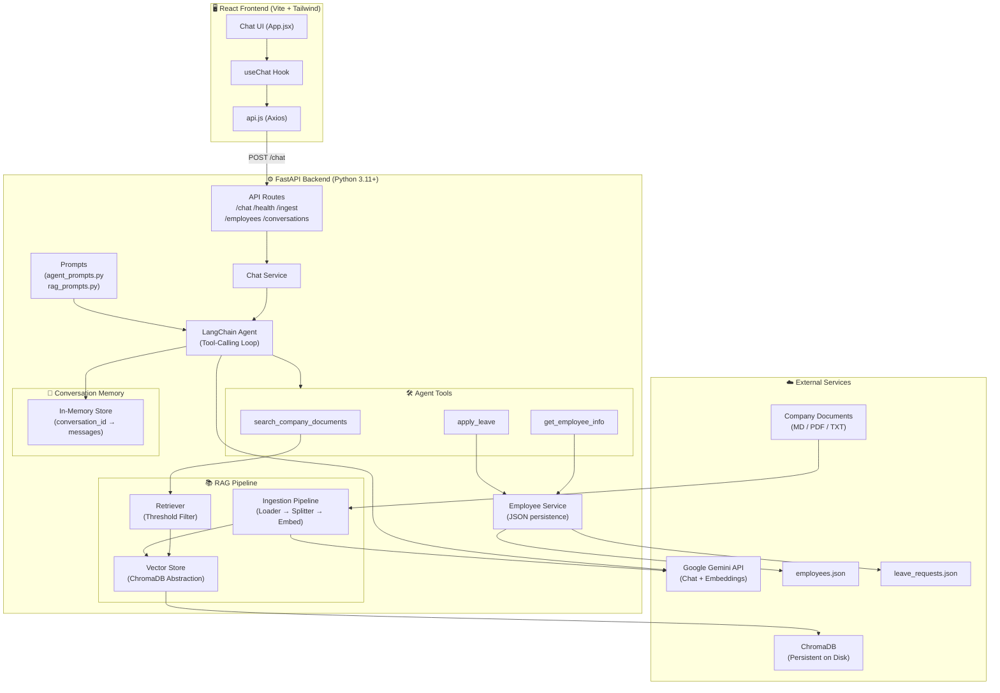
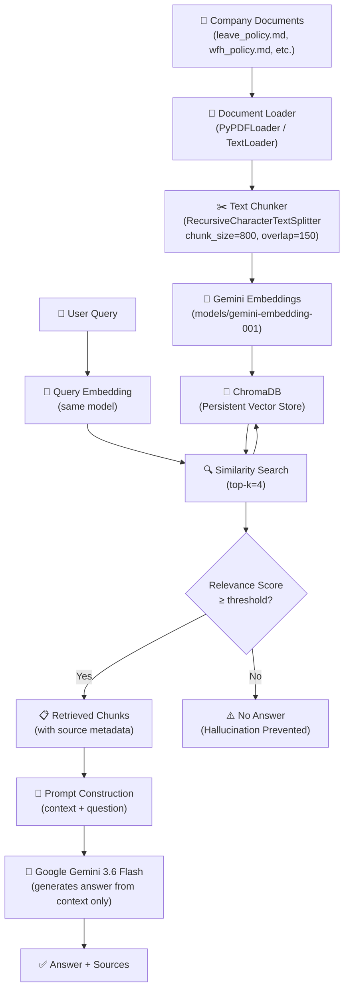
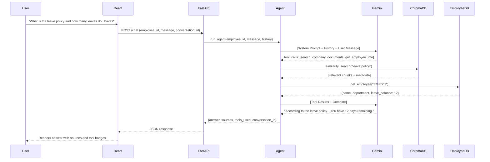
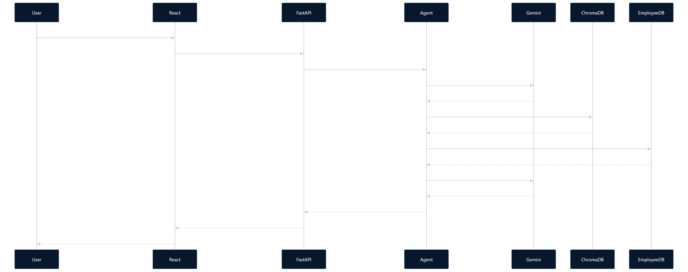

# Architecture — Employee AI Assistant

## System Architecture Diagram

---

## RAG Pipeline Detail

---

## Agent Tool-Calling Flow

---

## Data Flow Summary

| Layer | Technology | Purpose |
|-------|-----------|---------|
| Frontend | React + Vite + Tailwind | Chat UI |
| HTTP | Axios | Frontend → Backend |
| API | FastAPI + Uvicorn | REST endpoints |
| Agent | LangChain tool-calling | Multi-step reasoning |
| LLM | Google Gemini 3.6 Flash | Language understanding & generation |
| Embeddings | Google Gemini models/gemini-embedding-001 | Semantic search |
| Vector DB | ChromaDB (persistent) | Document chunk storage & search |
| Documents | MD / PDF / TXT files | Company knowledge base |
| Employee DB | JSON file | Mock employee database |
| Memory | In-memory dict | Conversation history |
